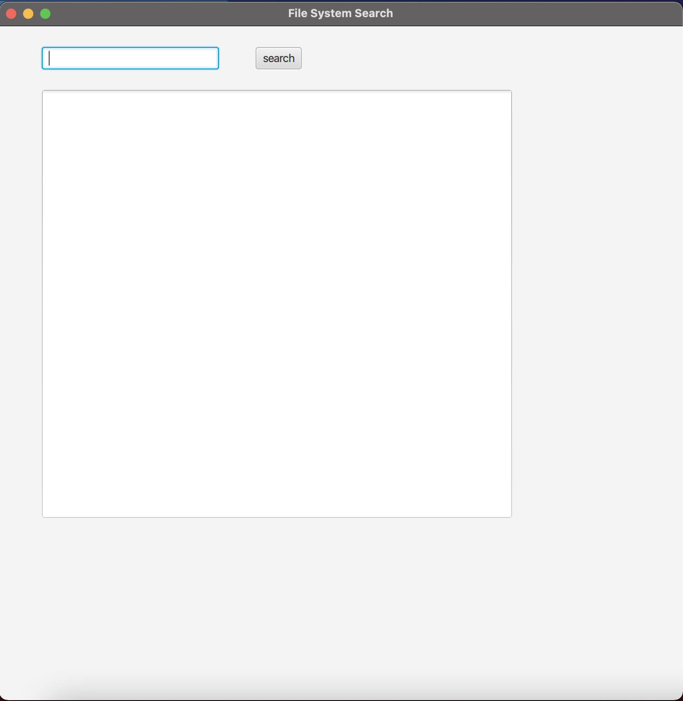
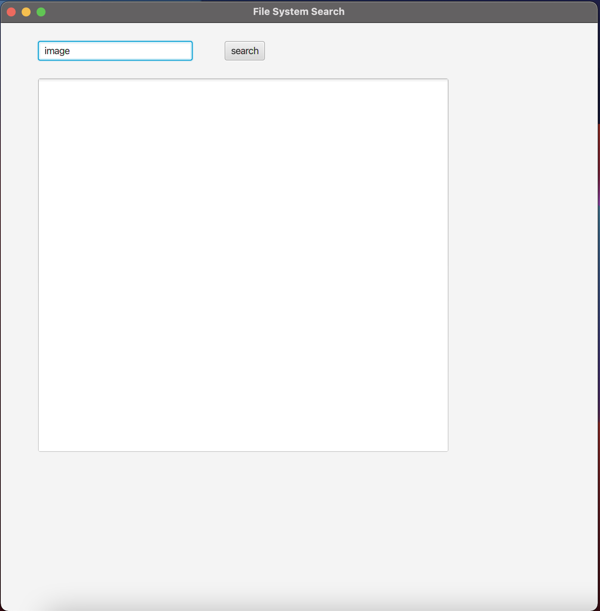
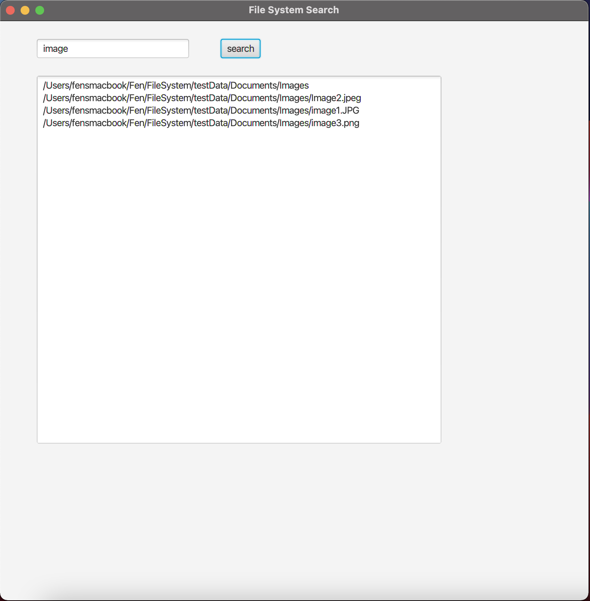

# File System Project
## Brief
File System Project allows users to search for files/directories with certain keyword and displays all matched files/directories under current directory to user interface.

## Environment
MySQL5.37, Java17, Maven, JFX

### Requirement
- Docker
- Java17
- JFX
- Maven

## Database
MySQL5.37 is selected because it is a stable version and easy to access without charge.

- Database name: file
- Table: node
- Columns inside node: id, name, path, type

## Manual Steps
- 1. Go to FileSystem directory
```bash
cd FileSystem #your FileSystem directory path
```
- 2. Build docker with provided docker file
```bash
make docker-up
```
- 3. Run program with Maven
```bash
mvn clean compile
```
```bash
mvn exec:java
```
- 4. User interface open



- 5. Search for certain file/directory with the user interface (eg. image)



- 6. See search result in the user interface


